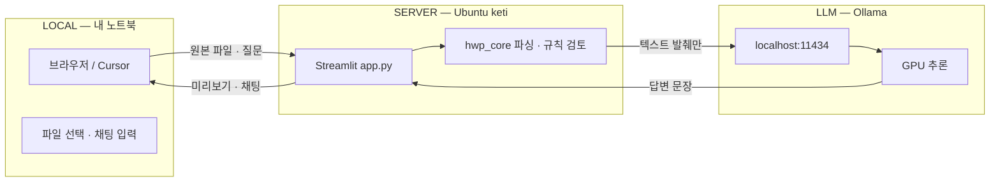
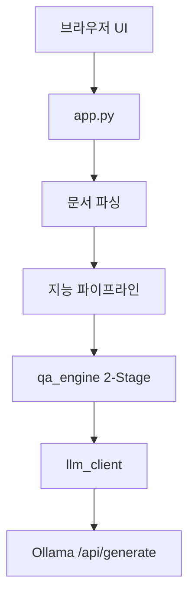
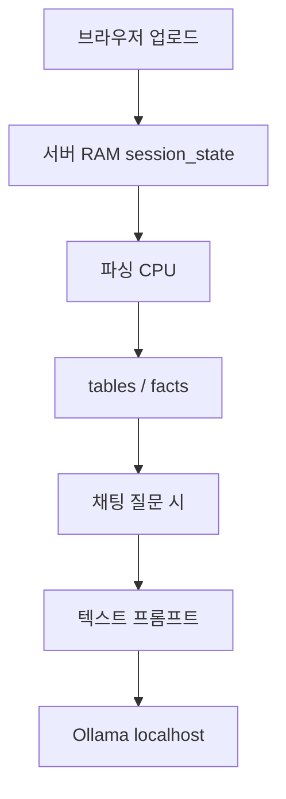

# HWP Analyzer — 구조 지도

GitHub에서도 보이는 구조 설명입니다. (Cursor Canvas는 로컬 IDE 전용)

---

## 0. Local · Server · LLM (큰 틀)

| 구간 | → 가는 것 | ← 오는 것 | 안 가는 것 |
|------|-----------|-----------|------------|
| Local ↔ Server | 원본 파일 바이트, 채팅 질문 | 미리보기, 답변, 다운로드 | 모델 가중치 (서버에만) |
| Server ↔ LLM | prompt 텍스트 (표·문단 발췌 + 질문) | 생성된 한국어 답 | 원본 `.hwp` / `.xlsx` 파일 |
| LLM ↔ 인터넷 | (기본) 없음 | (기본) 없음 | 문서 내용 전부 — `localhost`만 |

**비유:** LOCAL = 리모컨 · SERVER = 주방 · LLM = 같은 건물 안 셰프.  
금고(원본 파일)는 주방에만 두고, 셰프에게는 메모지(추출 텍스트)만 건넵니다.

---

## 1. 로컬 vs 서버

| 구분 | 비유 | 이 환경에서 |
|------|------|-------------|
| 로컬 (노트북) | 리모컨 + TV 화면 | Cursor / 브라우저 UI만. 코드·모델은 없음 |
| 서버 (keti) | 실제 TV / 주방 | 프로젝트, Python, Streamlit, Ollama |
| Ubuntu / Linux | 주방의 운영체제 | Ubuntu 22.04 = Linux 배포판 |
| Ollama | 주방의 AI 셰프 | 같은 서버에서 `serve`, GPU로 추론 |

- 코드 경로: `/home/eunbi/HWP analysis`
- Ollama 기본 URL: `http://localhost:11434` (= **서버 자기 자신**, 노트북이 아님)

---

## 2. 질문 하나가 흐르는 길

- Stage1: `gemma3:4b` — 의도 / 엔티티 JSON
- Stage2: `gemma4` 계열 — 근거 있는 답변
- 숫자 합계·조회는 **코드(Rules)** 가 먼저 계산하고, LLM은 설명·문장화

---

## 3. 프로젝트 폴더 역할

| 경로 | 역할 |
|------|------|
| `app.py` | Streamlit 진입점 |
| `ui/` | 미리보기 · 채팅 · 편집 UI |
| `hwp_core/` | 파싱 · 표 · Fact · Q&A |
| `hwp_core/llm_client.py` | Ollama HTTP 전담 |
| `hwpilot/` | `.hwp` Node CLI |
| `additional/` | AI 편집 · 참조 문서 파서 |

---

## 4. Ollama 호출

| 단계 | 코드 | HTTP | 의미 |
|------|------|------|------|
| 연결 확인 | `check_ollama_status()` | `GET /api/tags` | 모델 목록 · 살아있는지 |
| 답변 생성 | `generate()` | `POST /api/generate` | 프롬프트 → 토큰 응답 |
| 사이드바 | `app.py` | URL 입력칸 | 기본 `localhost:11434` |

---

## 5. 자주 헷갈리는 점

| 오해 | 실제 |
|------|------|
| 코드가 내 PC에 있다 | 코드는 서버 `HWP analysis`에 있음 |
| Ollama = 인터넷 AI | 같은 서버의 로컬 AI (기본 외부 전송 없음) |
| localhost = 내 노트북 | 서버 입장에서 localhost = 서버 자신 |
| 파일이 LLM으로 통째로 간다 | 추출 텍스트 발췌만 감 (~8000자) |

---

## 6. 파일 업로드 후 데이터 경로 (보안)

| 단계 | 무엇이 움직이나 | 어디로 | Ollama? |
|------|-----------------|--------|---------|
| 1. 업로드 | 원본 파일 바이트 | 서버 Streamlit 세션 메모리 | 아니오 |
| 2. 파싱 | 문단·표·숫자 | `hwp_core` (CPU) | 아니오 |
| 3. 자동 검토 | Fact·합계 규칙 | `intel_pipeline` + YAML | 기본 아니오 |
| 4. 채팅 질문 | 질문 + 관련 표/문단 텍스트 | `POST localhost:11434` | 예 (이때만) |
| 5. 답변 | 생성된 한국어 텍스트 | Streamlit 화면 | 응답만 |

### Ollama에 안 가는 것
- 원본 `.hwp` / `.hwpx` / `.xlsx` 바이너리
- 파일 경로·디스크 전체
- (기본) 인터넷 외부 API

### Ollama에 가는 것
- 시스템 규칙 + 사용자 질문
- 관련 표·문단 발췌
- 사전 계산 결과·최근 대화 일부

---

## 7. 2-Stage Q&A

| 역할 | 모델 예 | 받는 입력 | 하는 일 |
|------|---------|-----------|---------|
| Rules (코드) | 없음 | 표 숫자 | 합계·조회·비교 |
| Stage1 | `gemma3:4b` | 질문 + 표 헤더 | 의도/기관/지표 JSON |
| Stage2 | `gemma4` 등 | 발췌 텍스트 + 사전계산 + 질문 | 근거 있는 답 작성 |

---

## 8. 보안 문서일 때

| 걱정 | 답 |
|------|-----|
| 파일이 인터넷으로 나가나? | 기본 아니오 — localhost Ollama만 |
| 모델이 원본을 보관하나? | 아니오 — 요청 시 텍스트만 보고 답 생성 |
| 데이터는 어디에? | 업로드 세션 동안 서버 RAM · 서버 계정/권한은 별도 |
| 사이드바 URL을 외부로 바꾸면? | 그 주소로 텍스트가 감 — 기본값 `localhost` 유지 |

---

## 참고

- 구현: `hwp_core/llm_client.py`, `hwp_core/qa_engine.py`, `app.py` 사이드바
- Cursor에서 인터랙티브 Canvas를 보려면 로컬 IDE의 Canvas 파일을 여세요 (저장소 밖 `~/.cursor/projects/.../canvases/`).
