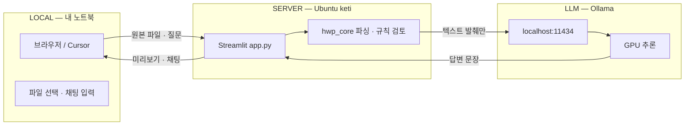
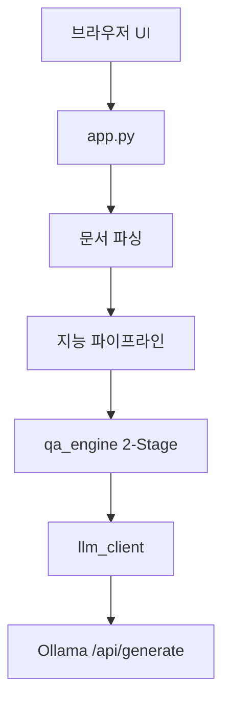
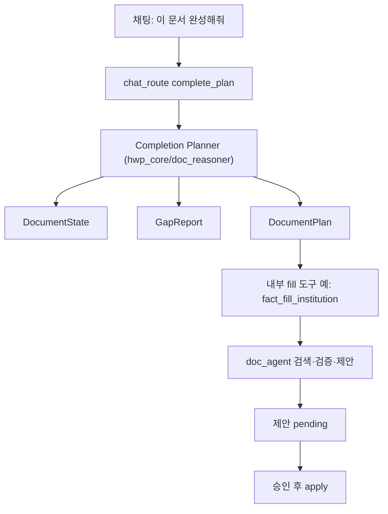
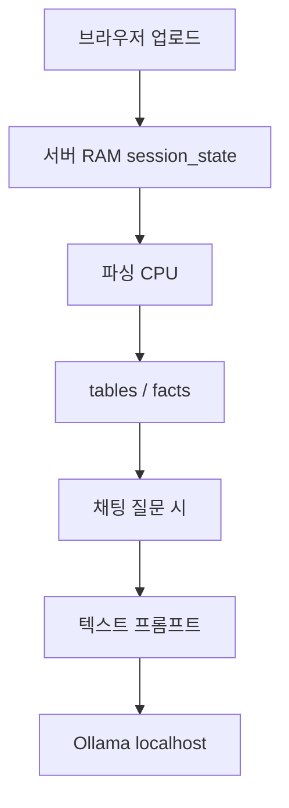

# HWP Analyzer — 구조 지도

GitHub에서도 보이는 구조 설명입니다. (Cursor Canvas는 로컬 IDE 전용)

---

## 0. Local · Server · LLM (큰 틀)




| 구간             | → 가는 것                    | ← 오는 것         | 안 가는 것                  |
| -------------- | ------------------------- | -------------- | ----------------------- |
| Local ↔ Server | 원본 파일 바이트, 채팅 질문          | 미리보기, 답변, 다운로드 | 모델 가중치 (서버에만)           |
| Server ↔ LLM   | prompt 텍스트 (표·문단 발췌 + 질문) | 생성된 한국어 답      | 원본 `.hwp` / `.xlsx` 파일  |
| LLM ↔ 인터넷      | (기본) 없음                   | (기본) 없음        | 문서 내용 전부 — `localhost`만 |


**비유:** LOCAL = 리모컨 · SERVER = 주방 · LLM = 같은 건물 안 셰프.  
금고(원본 파일)는 주방에만 두고, 셰프에게는 메모지(추출 텍스트)만 건넵니다.

---

## 1. 로컬 vs 서버


| 구분             | 비유          | 이 환경에서                          |
| -------------- | ----------- | ------------------------------- |
| 로컬 (노트북)       | 리모컨 + TV 화면 | Cursor / 브라우저 UI만. 코드·모델은 없음    |
| 서버 (keti)      | 실제 TV / 주방  | 프로젝트, Python, Streamlit, Ollama |
| Ubuntu / Linux | 주방의 운영체제    | Ubuntu 22.04 = Linux 배포판        |
| Ollama         | 주방의 AI 셰프   | 같은 서버에서 `serve`, GPU로 추론        |


- 코드 경로: `/home/eunbi/HWP analysis`
- Ollama 기본 URL: `http://localhost:11434` (= **서버 자기 자신**, 노트북이 아님)

---

## 2. 질문 하나가 흐르는 길




채팅에 「이 문서 완성해줘」처럼 **문서 완성(complete/fill)** 의도면 Product B는 Q&A·분석·수정이 아니라 **Completion Planner** 경로:



| 이전 (기능 버튼에 가까움) | 현재 (완성 계획 + 내부 도구) |
| ------------------------ | ---------------------------- |
| 사용자가 「기관 정보 채워줘」등 **기능 이름**을 말함 | 사용자가 「완성해줘」만 말함 |
| `if 문구 == 기관 → workflow_1` | Completion Planner: 상태 → 갭 → 계획 → 내부 fill 도구 |
| 워크플로 = 제품 표면 | 워크플로 = **내부 도구** (사용자 비노출) |

**Completion Planner 범위:** complete/fill만. analyze / review / ask / rewrite는 하지 않음.

**Document Reasoner (예약):** 나중에 analyze·review·ask·rewrite·complete 중 제품 태스크를 고르는 상위 층.

**계산(Computation):** Completion Planner는 오케스트레이션만. 값 찾기·검증·제안 생성은 기존 `doc_agent` 엔진(거의 동일).

- Stage1: `gemma3:4b` — 의도 / 엔티티 JSON  
- Stage2: `gemma4` 계열 — 근거 있는 답변  
- 숫자 합계·조회·표 쓰기는 **코드(Rules / doc_agent)** 가 하고, LLM은 설명·글 초안만  

---

## 3. 프로젝트 폴더 역할


| 경로                        | 역할                                            |
| ------------------------- | --------------------------------------------- |
| `app.py`                  | Streamlit 진입점 — 검토 홈 + 문서/채팅                  |
| `ui/`                     | 미리보기 · 채팅 · 편집 · 검토 UI                        |
| `ui/review_home.py`       | 이슈 요약 홈 (모드 없음)                               |
| `ui/doc_work_panel.py`    | 채우기 제안 카드 (채팅 아래에서만)                          |
| `ui/command_router.py`    | 질문 vs 편집/채우기 intent                           |
| `ui/brand.py`             | 상용형 테마 CSS                                    |
| `hwp_core/`               | 파싱 · 표 · Fact · Q&A · 규칙                      |
| `hwp_core/doc_reasoner/`  | **Completion Planner** — DocumentState · GapReport · Plan · fill 도구 선택 (complete/fill만) |
| `hwp_core/doc_agent/`     | 채우기 엔진 (inspect→propose→apply) — Completion Planner가 호출 |
| `hwp_core/workflows/`     | 내부 fill 도구 어댑터 (예: institution FactFill) — UX 메뉴 아님 |
| `hwp_core/ontology/`      | budget / doc_fill 개념 YAML                     |
| `hwp_core/rules/`         | 검토 규칙 YAML                                    |
| `hwp_core/prompts/`       | Stage1/2 프롬프트 MD                              |
| `hwp_core/llm_client.py`  | Ollama HTTP 전담                                |
| `hwpilot/`                | `.hwp` Node CLI                               |
| `additional/`             | AI 편집 · 참조 문서 파서                              |
| `data/doc_work/`          | 채우기 적용 스냅샷 (원본 보존)                            |
| `tests/test_doc_agent.py` | doc_agent 회귀 테스트                              |


### UX 한 줄 (현재)

```text
업로드 → (A) 검토 홈 / (B) 편집 워크스페이스 + 채팅
  B 채팅 「이 문서 완성해줘」
    → Completion Planner(상태·갭·계획) → 내부 fill 도구 → 제안 pending → 수락 → 다운로드
```

별도 「빈 칸 채우기」모드/CTA·워크플로 메뉴 없음. **완성(complete/fill)** 의도만 Completion Planner로.
### doc_agent 채우기 원칙


| 항목             | 규칙                               |
| -------------- | -------------------------------- |
| 숫자·표 셀·HWPX 쓰기 | 코드만                              |
| 글 초안           | LLM 선택 (없어도 표 삽입 가능)             |
| 서식 빈칸 (공고번호 등) | 참고자료에 **같은 라벨 값이 있을 때만**         |
| 예실대비 Excel     | 줄글 요약 금지 → **표로 삽입**             |
| 원본 파일          | 불변 · 수정본만 `data/doc_work` + 다운로드 |


---

## 4. Ollama 호출


| 단계    | 코드                      | HTTP                 | 의미                   |
| ----- | ----------------------- | -------------------- | -------------------- |
| 연결 확인 | `check_ollama_status()` | `GET /api/tags`      | 모델 목록 · 살아있는지        |
| 답변 생성 | `generate()`            | `POST /api/generate` | 프롬프트 → 토큰 응답         |
| 사이드바  | `app.py`                | URL 입력칸              | 기본 `localhost:11434` |


---

## 5. 자주 헷갈리는 점


| 오해                | 실제                         |
| ----------------- | -------------------------- |
| 코드가 내 PC에 있다      | 코드는 서버 `HWP analysis`에 있음  |
| Ollama = 인터넷 AI   | 같은 서버의 로컬 AI (기본 외부 전송 없음) |
| localhost = 내 노트북 | 서버 입장에서 localhost = 서버 자신  |
| 파일이 LLM으로 통째로 간다  | 추출 텍스트 발췌만 감 (~8000자)      |


---

## 6. 파일 업로드 후 데이터 경로 (보안)




| 단계          | 무엇이 움직이나         | 어디로                             | Ollama?   |
| ----------- | ---------------- | ------------------------------- | --------- |
| 1. 업로드      | 원본 파일 바이트        | 서버 Streamlit 세션 메모리             | 아니오       |
| 2. 파싱       | 문단·표·숫자          | `hwp_core` (CPU)                | 아니오       |
| 3. 자동 검토    | Fact·합계 규칙       | `intel_pipeline` + YAML         | 기본 아니오    |
| 4. 채팅 질문    | 질문 + 관련 표/문단 텍스트 | `POST localhost:11434`          | 예 (이때만)   |
| 5. 채우기 (선택) | 빈칸·엑셀 표          | `doc_agent` CPU → 승인 후 HWPX 바이트 | 글 초안만 선택적 |
| 6. 답변/다운로드  | 생성 텍스트 · 수정본     | Streamlit 화면                    | 응답만       |


### Ollama에 안 가는 것

- 원본 `.hwp` / `.hwpx` / `.xlsx` 바이너리
- 파일 경로·디스크 전체
- (기본) 인터넷 외부 API
- 채우기 시 표 셀·숫자의 **결정/쓰기** (코드가 함)

### Ollama에 가는 것

- 시스템 규칙 + 사용자 질문
- 관련 표·문단 발췌
- 사전 계산 결과·최근 대화 일부
- (이슈 설명 시) 검토 엔진이 확정한 Issue 필드 블록 — 숫자는 재계산하지 말라는 지시와 함께
- (채우기 글 초안 시, LLM 켠 경우) 항목 라벨 + 근거 발췌만

---

## 7. 2-Stage Q&A


| 역할         | 모델 예        | 받는 입력                           | 하는 일          |
| ---------- | ----------- | ------------------------------- | ------------- |
| Rules (코드) | 없음          | 표 숫자                            | 합계·조회·비교      |
| Stage1     | `gemma3:4b` | 질문 + 표 헤더                       | 의도/기관/지표 JSON |
| Stage2     | `gemma4` 등  | 발췌 + 사전계산 + (선택) 구조화 Issue + 질문 | 근거 있는 답 작성    |


이슈 카드 **「채팅으로 설명」** 은 질문 문자열만 넣지 않고 `Issue` 필드(`rule_id`, expected/actual, source, 표·행)를 `QAEngine.answer(..., issues=)` 로 넘긴다. LLM 꺼짐 → 같은 필드로 결정적 체크리스트.

---

## 8. 보안 문서일 때


| 걱정                 | 답                                 |
| ------------------ | --------------------------------- |
| 파일이 인터넷으로 나가나?     | 기본 아니오 — localhost Ollama만        |
| 모델이 원본을 보관하나?      | 아니오 — 요청 시 텍스트만 보고 답 생성           |
| 데이터는 어디에?          | 업로드 세션 동안 서버 RAM · 서버 계정/권한은 별도   |
| 사이드바 URL을 외부로 바꾸면? | 그 주소로 텍스트가 감 — 기본값 `localhost` 유지 |


---

## 참고

- 구현: `hwp_core/llm_client.py`, `hwp_core/qa_engine.py`, `app.py` 사이드바
- Cursor에서 인터랙티브 Canvas를 보려면 로컬 IDE의 Canvas 파일을 여세요 (저장소 밖 `~/.cursor/projects/.../canvases/`).

