# HWP 문서 분석기

한글(HWP/HWPX)·엑셀 문서를 업로드해 표·숫자를 구조화하고, 로컬 LLM으로 질의응답·AI 편집·자동 검토를 지원하는 내부 문서 분석 도구.

- **HWP/HWPX/Excel 문서에서 표·숫자·본문 사실을 추출하고, 질의응답 및 일관성 검토 지원**
- **예산서·사업계획서·성과지표 등 내부 문서를 로컬 환경에서 안전하게 분석/활용**

0709 ver.


## 주요 기능

- **문서 분석·질의응답** — HWP/HWPX/Excel 업로드 후 표·숫자 추출, Ollama 기반 2-Stage Q&A
- **통합 작업 화면** — 왼쪽 미리보기/직접편집, 오른쪽 **💬 이 파일 | 💬 전체** 채팅
- **HWP/HWPX 편집** — 채팅 명령·캔버스 직접 편집, 미리보기 diff (🟡 제안 / 🔴 적용 / 🟢 신규)
- **Excel** — 표 미리보기·`data_editor` 수정·xlsx 다운로드
- **자동 검토** — 업로드 시 합계·예실대비·문서 간 수치 일관성 검사; **이슈 있을 때만** 화면에 알림

## 프로젝트 구조

```
HWP analysis/
├── app.py                      # Streamlit 진입점
├── requirements.txt
├── hwpilot/                    # Node CLI — .hwp 읽기·변환·편집
│
├── hwp_core/
│   ├── ontology/
│   │   └── budget_concepts.yaml   # 예산 도메인 개념 사전 (동의어·패턴)
│   ├── concept_resolver.py        # 라벨 → concept_id (semantic grounding)
│   ├── hwp_parser.py              # HWP/HWPX 파싱
│   ├── hwp_backends.py            # hwpilot / pyhwp / LibreOffice / olefile
│   ├── table_extractor.py         # 표·숫자 구조화
│   ├── fact_extractor.py          # Fact 추출 (concept + value + source)
│   ├── consistency_checker.py     # 규칙 기반 일관성 검증
│   ├── intel_pipeline.py          # intel 파이프라인 조립
│   ├── qa_engine.py               # 2-Stage LLM Q&A
│   ├── llm_client.py              # Ollama 연결
│   └── hwpx_editor.py             # HWPX 편집
│
├── ui/
│   ├── document_workspace.py      # HWP/HWPX/Excel 통합 분할 UI
│   ├── document_preview.py        # HTML 미리보기·diff
│   ├── command_router.py          # 채팅 의도 분류·편집 실행
│   ├── canvas_editor.py           # 직접 편집
│   └── session_store.py           # 세션·편집 상태
│
└── additional/
    ├── ai_editor.py               # LLM 빈칸/초안/리라이트
    └── reference_parser.py        # Excel·PDF·DOCX 등 파싱
```
```

## 설치 및 실행

```bash
pip install -r requirements.txt  # pyhwp CLI: hwp5txt, hwp5html

# hwpilot — .hwp 업로드·편집 시 필요 (repo 번들 또는 전역 설치)
npm install -g hwpilot
# 또는: cd hwpilot && npm install   # repo 내 dist/ 사용

streamlit run app.py #실행
```

### 분석·Q&A

```
┌────────────────────────────────────────────────────────────────────────────────────┐
│                            app.py (Streamlit UI)                                   │
│  파일 업로드 → process_document() → 세션 캐시 → 2분할 UI (미리보기 + 채팅)           │
└──────┬──────────────────┬────────────────────┬────────────────────┬─────────────────┘
       │                  │                    │                    │
┌──────▼─────────┐ ┌──────▼──────────┐ ┌─────▼────────────┐ ┌────▼──────────────┐
│ 파싱            │ │ table_extractor │ │ intel_pipeline   │ │ qa_engine        │
│                │ │                 │ │                  │ │                   │
│ Excel:         │ │ rows→DataFrame  │ │ fact_extractor   │ │ Stage 1: gemma3:4b│
│  reference_    │ │ NumberInfo 탐지 │ │ consistency_     │ │  의도·엔티티 추출  │
│  parser        │─▶│ TableSummary  │─▶│ checker         │─▶│ Pre-compute /  │
│ HWPX: ZIP→XML  │ │                 │ │ → intel_panel    │ │  Rule-based       │
│ HWP: hwpilot   │ │                 │ │  (이슈 시만 UI)  │ │ Stage 2: gemma4   │
│  fallback chain│ │                 │ │                  │ │  (스트리밍)       │
└────────────────┘ └─────────────────┘ └──────────────────┘ └───────────────────┘
```


```mermaid
flowchart LR
    subgraph Input
        B[file_bytes]
        FN[filename.ext]
    end

    subgraph Router["process_document()"]
        EXT{ext?}
    end

    subgraph Excel_Path["Excel — openpyxl"]
        X1[reference_parser]
        X2[tables_raw + full_text]
    end

    subgraph HWPX_Path["HWPX — Pure Python"]
        Z1[ZipFile.read]
        Z2[section*.xml]
        Z3[ElementTree parse]
        Z4[paragraphs + tables_raw]
    end

    subgraph HWP_Path["HWP — Fallback Chain"]
        F1["① hwpilot read"]
        F2["② pyhwp hwp5html"]
        F3["③ hwpilot convert → parse_hwpx"]
        F4["④ LibreOffice convert"]
        F5["⑤ olefile + zlib"]
    end

    subgraph Enrich["Post-process (CPU)"]
        ET[extract_tables]
        NT[detect_numbers_in_text]
        NB[detect_numbers_in_tables]
    end

    subgraph Intel["지능 서비스 (1단계)"]
        CR[concept_resolver<br/>ontology YAML]
        FE[fact_extractor]
        CC[consistency_checker]
        IP[intel_pipeline]
    end

    subgraph Output["Session"]
        C["doc_payload<br/>tables · numbers · intel"]
        QA[qa_engine]
    end

    B --> EXT
    FN --> EXT
    EXT -->|.xlsx .xls| Excel_Path
    EXT -->|.hwpx| HWPX_Path
    EXT -->|.hwp 등| HWP_Path
    Excel_Path --> Enrich
    HWPX_Path --> Enrich
    F1 -->|success| Enrich
    F1 -->|fail| F2
    F2 -->|fail| F3
    F3 -->|fail| F4
    F4 -->|fail| F5
    F5 --> Enrich
    Enrich --> CR
    CR --> FE --> CC --> IP
    IP --> C
    C --> QA
```

### 지능 서비스 (1단계)

업로드된 문서에서 표·본문의 라벨을 예산 도메인 **ontology**(`budget_concepts.yaml`)와 매칭해 **concept_id**로 연결(`ConceptResolver`). 
매칭된 결과는 **Fact**(개념 + 값 + 단위 + 출처)로 정리되고, `consistency_checker`가 표 합계·계획/실행·문서 간 수치 등을 **규칙 기반**으로 검증. 
숫자 판단과 계산은 코드가 담당하고, LLM은 Q&A·설명에 사용합니다. 검토 이슈가 있을 때만 화면에 알림. 

0702 ver.


